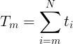
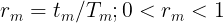
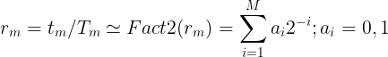
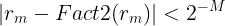
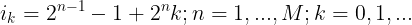
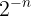

# Real Time Scheduler

## Theory

### Definitions

* *t_m*, *m* = 0, 1, ..., *N*: CPU time spent in task priority *m* measured in
  time-span *T*, where 0: highest priority, *N*: lowest priority.

* *T_m* defined as:

  

  is CPU time spent in tasks with priority *m*, *m + 1*, ..., *N*.
  Therefore *T = T_0*

* Time ratio:

  

### Time Scheduling

For given priority *m*, *r_m* is factorized into 2-base fraction:



where *M* (default 8) defines accuracy of the factorization:



Each *n*-th element of the factorized ratio *r_m* translates into distribution
of *t_m*'s time ticks in the time-span *T_m* as follows:



where *i_k* denotes *k*-th index of *t_m*'s tick in *T_m* time-span, corresponding
to  element of ratio *r_m*.

## Build

```
cmake -B BUILD .
cmake --build BUILD
```
